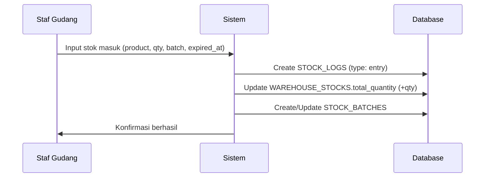
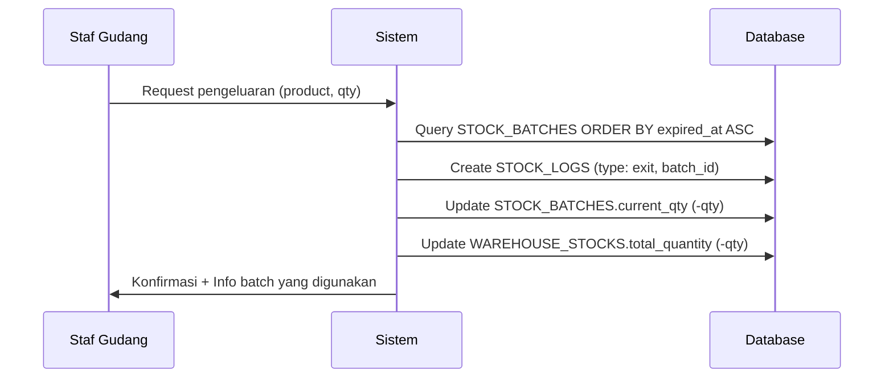
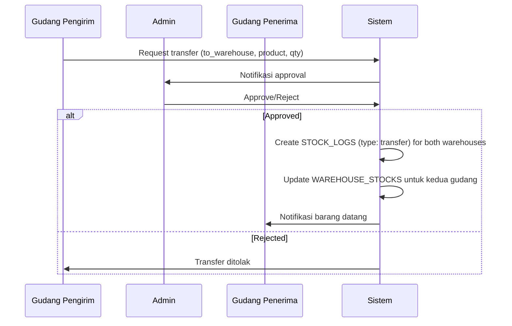
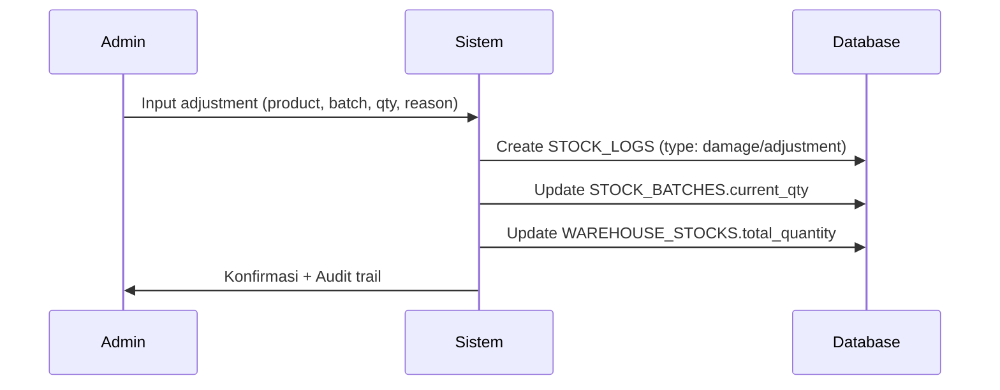

.# gudangKu - Sistem Manajemen Gudang Multi-Lokasi


Sistem manajemen inventori internal untuk **PT. Rizquna Berkah Mandiri (RBM)** yang dirancang khusus untuk mengelola banyak gudang, memantau tanggal kedaluwarsa produk susu menggunakan metode **FEFO (First Expired First Out)**, dan menyediakan audit trail yang lengkap.

## 📋 Daftar Isi

- [Fitur Utama](#-fitur-utama)
- [Technology Stack](#-technology-stack)
- [Arsitektur Sistem](#-arsitektur-sistem)
- [Entity Relationship Diagram](#-entity-relationship-diagram)
- [Instalasi](#-instalasi)
- [Konfigurasi](#-konfigurasi)
- [Alur Kerja Sistem](#-alur-kerja-sistem)
- [Testing](#-testing)
- [Kontribusi](#-kontribusi)

## ✨ Fitur Utama

### 🔐 Manajemen Pengguna & Akses
- **Role-Based Access Control** terintegrasi dengan Spatie Laravel Permission
- 3 Level akses: Super Admin, Admin, dan Viewer
- Penugasan staf ke gudang tertentu melalui `warehouse_users`
- Autentikasi menggunakan Laravel Fortify

### 📦 Manajemen Multi-Gudang
- Kelola banyak gudang dalam satu sistem terpusat
- Tracking stok per gudang dan per produk
- Transfer stok antar gudang dengan approval workflow
- Real-time monitoring ketersediaan stok

### 📅 FEFO (First Expired First Out)
- Tracking batch number dengan tanggal kedaluwarsa
- Peringatan otomatis untuk produk yang mendekati expired
- Prioritas pengeluaran berdasarkan tanggal expired
- Status batch: Available, Warning, Expired

### 📊 Audit Trail Lengkap
- Pencatatan semua mutasi stok (masuk, keluar, transfer, adjustment, kerusakan)
- Tracking user yang melakukan transaksi
- Riwayat lengkap per produk, batch, dan gudang
- Laporan komprehensif untuk analisis

### 📱 User Interface Modern
- Responsive design dengan Tailwind CSS 4
- Single Page Application menggunakan Inertia.js + React
- Real-time updates dan seamless navigation
- Dark mode support

## 🛠 Technology Stack

### Backend
- **Laravel 12** - PHP Framework
- **Laravel Fortify** - Authentication
- **Spatie Laravel Permission** - Role & Permission Management
- **PHP 8.3** - Programming Language

### Frontend
- **React 19** - UI Library
- **Inertia.js v2** - Modern Monolith
- **TypeScript** - Type Safety
- **Tailwind CSS 4** - Styling
- **Laravel Wayfinder** - Type-safe routing

### Development Tools
- **Pest 4** - Testing Framework
- **Laravel Pint** - Code Style Fixer
- **ESLint 9** - JavaScript Linter
- **Prettier 3** - Code Formatter
- **Vite** - Frontend Build Tool

## 🏗 Arsitektur Sistem

Sistem ini menggunakan arsitektur monolith modern dengan Inertia.js yang menggabungkan keunggulan server-side rendering dan client-side interactivity.

```
┌─────────────────────────────────────────────────────┐
│                   Browser/Client                     │
│            (React + TypeScript + Inertia)            │
└──────────────────────┬──────────────────────────────┘
                       │ JSON/Props
┌──────────────────────┴──────────────────────────────┐
│              Laravel Application                     │
│  ┌─────────────────────────────────────────────┐   │
│  │         Inertia Middleware                  │   │
│  └─────────────────────────────────────────────┘   │
│  ┌─────────────────────────────────────────────┐   │
│  │    Controllers & Business Logic             │   │
│  └─────────────────────────────────────────────┘   │
│  ┌─────────────────────────────────────────────┐   │
│  │    Eloquent Models & Relationships          │   │
│  └─────────────────────────────────────────────┘   │
└──────────────────────┬──────────────────────────────┘
                       │
┌──────────────────────┴──────────────────────────────┐
│              MySQL Database                          │
└─────────────────────────────────────────────────────┘
```

## 📊 Entity Relationship Diagram

### 1. Kelompok Pengguna & Akses (Spatie Integrated)

**USERS**
```
- id (PK)
- name
- email (unique)
- password
- created_at
- updated_at
```

**ROLES**
```
- id (PK)
- name (super-admin, admin, viewer)
- guard_name
```

**MODEL_HAS_ROLES** (Pivot table Spatie)
```
- role_id (FK)
- model_id (FK)
- model_type
```

**WAREHOUSE_USERS** (Penugasan staf ke gudang)
```
- id (PK)
- warehouse_id (FK -> warehouses.id)
- user_id (FK -> users.id)
- created_at
- updated_at
UNIQUE(warehouse_id, user_id)
```

### 2. Kelompok Master Data & Katalog

**CATEGORIES**
```
- id (PK)
- name (Contoh: UHT, Fullcream, Plain)
- slug (unique)
- created_at
- updated_at
```

**PRODUCTS**
```
- id (PK)
- category_id (FK -> categories.id)
- name
- brand
- unit (Contoh: Karton, Box)
- sku (unique)
- created_at
- updated_at
```

**WAREHOUSES**
```
- id (PK)
- name
- address
- description
- created_at
- updated_at
```

### 3. Kelompok Inventori & Stok Multi-Gudang

**WAREHOUSE_STOCKS**
```
- id (PK)
- warehouse_id (FK -> warehouses.id)
- product_id (FK -> products.id)
- total_quantity (integer, default: 0)
- created_at
- updated_at
UNIQUE(warehouse_id, product_id)
```

**STOCK_BATCHES**
```
- id (PK)
- warehouse_stock_id (FK -> warehouse_stocks.id)
- batch_number (varchar)
- expired_at (date)
- current_qty (integer)
- is_active (boolean, default: true)
- status (enum: available, expired, warning)
- created_at
- updated_at
```

### 4. Kelompok Mutasi & Audit Trail

**STOCK_TRANSFERS**
```
- id (PK)
- from_warehouse_id (FK -> warehouses.id)
- to_warehouse_id (FK -> warehouses.id)
- product_id (FK -> products.id)
- qty (integer)
- user_id (FK -> users.id)
- status (enum: pending, completed, rejected)
- notes (text, nullable)
- created_at
- updated_at
```

**STOCK_LOGS** (Audit Trail)
```
- id (PK)
- warehouse_id (FK -> warehouses.id)
- product_id (FK -> products.id)
- batch_id (FK -> stock_batches.id, nullable)
- user_id (FK -> users.id)
- qty (integer) // Positif = masuk, Negatif = keluar/rusak
- type (enum: entry, exit, transfer, adjustment, damage)
- notes (text, nullable)
- created_at
```

### Relasi Antar Tabel

```
USERS 1:N WAREHOUSE_USERS N:1 WAREHOUSES
USERS N:M ROLES (via MODEL_HAS_ROLES)
USERS 1:N STOCK_LOGS
USERS 1:N STOCK_TRANSFERS

CATEGORIES 1:N PRODUCTS

PRODUCTS N:M WAREHOUSES (via WAREHOUSE_STOCKS)
PRODUCTS 1:N STOCK_LOGS
PRODUCTS 1:N STOCK_TRANSFERS

WAREHOUSES 1:N WAREHOUSE_STOCKS
WAREHOUSES 1:N STOCK_LOGS
WAREHOUSES 1:N STOCK_TRANSFERS (as from/to)

WAREHOUSE_STOCKS 1:N STOCK_BATCHES
STOCK_BATCHES 1:N STOCK_LOGS
```

## 🚀 Instalasi

### Prasyarat

- PHP 8.3 atau lebih tinggi
- Composer 2.x
- Node.js 18+ dan NPM/Yarn
- MySQL 8.0+
- Git

### Langkah Instalasi

1. **Clone Repository**
```bash
git clone <repository-url> gudangku
cd gudangku
```

2. **Install Dependencies Backend**
```bash
composer install
```

3. **Install Dependencies Frontend**
```bash
npm install
```

4. **Environment Configuration**
```bash
cp .env.example .env
php artisan key:generate
```

5. **Database Setup**

Edit file `.env` sesuai dengan konfigurasi database Anda:
```env
DB_CONNECTION=mysql
DB_HOST=127.0.0.1
DB_PORT=3306
DB_DATABASE=gudangku
DB_USERNAME=root
DB_PASSWORD=
```

Jalankan migration dan seeder:
```bash
php artisan migrate --seed
```

6. **Build Assets**

Development:
```bash
npm run dev
```

Production:
```bash
npm run build
```

7. **Jalankan Aplikasi**

Menggunakan Laravel development server:
```bash
php artisan serve
```

Atau menggunakan Laravel Sail (Docker):
```bash
./vendor/bin/sail up
```

Aplikasi akan berjalan di `http://localhost:8000`

## ⚙️ Konfigurasi

### Role & Permission Default

Setelah instalasi, sistem akan membuat 3 role default:

1. **Super Admin** - Akses penuh ke seluruh sistem
2. **Admin** - Manajemen stok, produk, dan gudang
3. **Viewer** - Hanya dapat melihat data (read-only)

### User Default

```
Email: admin@rbm.com
Password: password
Role: Super Admin
```

**PENTING:** Segera ubah password default setelah instalasi pertama!

### Laravel Boost (MCP Server)

Proyek ini sudah terintegrasi dengan Laravel Boost untuk development experience yang lebih baik:

```bash
php artisan boost:install
```

## 🔄 Alur Kerja Sistem

### 1. Setup Awal

```
Super Admin → Buat Kategori Produk → Buat Produk → Buat Gudang → Assign User ke Gudang
```

### 2. Stock Entry (Barang Masuk)



### 3. Stock Exit (Barang Keluar) - FEFO



### 4. Transfer Antar Gudang



### 5. Stock Adjustment (Kerusakan/Penyesuaian)



### 6. Monitoring Expired (Automated)

Sistem secara otomatis menjalankan scheduler untuk:
- Update `STOCK_BATCHES.status` berdasarkan `expired_at`
- Kirim notifikasi untuk produk yang akan expired dalam 30 hari
- Update status batch yang sudah expired menjadi inactive

```php
// Scheduled daily
php artisan schedule:work
```

## 🏗️ Development Workflow

### 📋 Urutan Pengerjaan (Development Roadmap)

Ikuti urutan ini untuk membangun sistem secara sistematis:

#### **FASE 1: Foundation & Authentication** ✅ (Sudah selesai)
- [x] Setup Laravel 12 + Inertia + React
- [x] Instalasi Laravel Fortify
- [x] Instalasi Spatie Laravel Permission
- [x] Setup Authentication UI

#### **FASE 2: Master Data & Roles** 🎯 (Mulai dari sini!)

**Step 1: Setup Roles & Permissions**
```bash
# Buat seeder untuk roles
php artisan make:seeder RoleSeeder
```

Edit `database/seeders/RoleSeeder.php`:
```php
use Spatie\Permission\Models\Role;

Role::create(['name' => 'super-admin']);
Role::create(['name' => 'admin']);
Role::create(['name' => 'viewer']);
```

Jalankan seeder:
```bash
php artisan db:seed --class=RoleSeeder
```

**Step 2: Categories**
```bash
php artisan make:model Category -mcr
php artisan make:request StoreCategoryRequest
php artisan make:request UpdateCategoryRequest
php artisan make:policy CategoryPolicy --model=Category
```

**Step 3: Products**
```bash
php artisan make:model Product -mcr
php artisan make:request StoreProductRequest
php artisan make:request UpdateProductRequest
php artisan make:policy ProductPolicy --model=Product
```

**Step 4: Warehouses**
```bash
php artisan make:model Warehouse -mcr
php artisan make:request StoreWarehouseRequest
php artisan make:request UpdateWarehouseRequest
php artisan make:policy WarehousePolicy --model=Warehouse
```

**Step 5: Warehouse Users (Pivot)**
```bash
php artisan make:model WarehouseUser -m
```

---

#### **FASE 3: Inventori & FEFO System** 📦

**Step 6: Warehouse Stocks**
```bash
php artisan make:model WarehouseStock -m
php artisan make:policy WarehouseStockPolicy --model=WarehouseStock
```

**Step 7: Stock Batches (FEFO Core)**
```bash
php artisan make:model StockBatch -mcr
php artisan make:request StoreStockBatchRequest
php artisan make:request UpdateStockBatchRequest
php artisan make:policy StockBatchPolicy --model=StockBatch
```

**Step 8: Service Layer (WAJIB!)**
```bash
# Buat direktori services
mkdir app/Services

# Buat service files
touch app/Services/StockService.php
touch app/Services/FefoService.php
touch app/Services/TransferService.php
```

Struktur `FefoService.php`:
```php
<?php

namespace App\Services;

use App\Models\StockBatch;
use Carbon\Carbon;

class FefoService
{
    /**
     * Ambil batch yang harus keluar duluan (First Expired First Out)
     */
    public function getNextBatch($warehouseStockId, $requiredQty)
    {
        return StockBatch::where('warehouse_stock_id', $warehouseStockId)
            ->where('is_active', true)
            ->where('status', 'available')
            ->where('current_qty', '>', 0)
            ->orderBy('expired_at', 'asc')
            ->first();
    }
    
    /**
     * Cek batch yang akan expired dalam X hari
     */
    public function checkExpiringSoon($days = 30)
    {
        return StockBatch::where('is_active', true)
            ->where('status', 'available')
            ->where('expired_at', '<=', Carbon::now()->addDays($days))
            ->where('expired_at', '>', Carbon::now())
            ->with(['warehouseStock.product', 'warehouseStock.warehouse'])
            ->get();
    }
}
```

---

#### **FASE 4: Mutasi & Audit Trail** 🔄

**Step 9: Stock Transfers**
```bash
php artisan make:model StockTransfer -mcr
php artisan make:request StoreStockTransferRequest
php artisan make:request UpdateStockTransferRequest
php artisan make:policy StockTransferPolicy --model=StockTransfer
```

**Step 10: Stock Logs (Audit)**
```bash
php artisan make:model StockLog -m
```

---

#### **FASE 5: Automation & Monitoring** 🤖

**Step 11: Command untuk Auto-Expire**
```bash
php artisan make:command CheckExpiredBatches
```

Edit `app/Console/Commands/CheckExpiredBatches.php`:
```php
<?php

namespace App\Console\Commands;

use App\Models\StockBatch;
use Carbon\Carbon;
use Illuminate\Console\Command;

class CheckExpiredBatches extends Command
{
    protected $signature = 'batches:check-expired';
    protected $description = 'Check and update expired batches status';

    public function handle()
    {
        $expired = StockBatch::where('expired_at', '<', Carbon::now())
            ->where('status', '!=', 'expired')
            ->update([
                'status' => 'expired',
                'is_active' => false
            ]);

        $warning = StockBatch::where('expired_at', '<=', Carbon::now()->addDays(30))
            ->where('expired_at', '>', Carbon::now())
            ->where('status', 'available')
            ->update(['status' => 'warning']);

        $this->info("Updated {$expired} expired batches");
        $this->info("Updated {$warning} warning batches");
    }
}
```

Daftarkan di `routes/console.php`:
```php
use Illuminate\Support\Facades\Schedule;

Schedule::command('batches:check-expired')->daily();
```

---

#### **FASE 6: Seeding & Testing** 🌱

**Step 12: Buat Seeders**
```bash
php artisan make:seeder WarehouseSeeder
php artisan make:seeder CategorySeeder
php artisan make:seeder ProductSeeder
```

**Step 13: Buat Factory & Tests**
```bash
# Update factories untuk setiap model
# Buat feature tests
php artisan make:test CategoryTest --pest
php artisan make:test ProductTest --pest
php artisan make:test WarehouseTest --pest
php artisan make:test StockBatchTest --pest
php artisan make:test StockTransferTest --pest
```

---

### 🏛️ Arsitektur Sistem (Detail)

#### **1️⃣ USER & AKSES (Spatie + Fortify)**

**User Model** - Default Laravel, tidak perlu dibuat ulang
```
Model: App\Models\User (sudah ada)
```

**Roles & Permissions**
```php
// Sudah terintegrasi dengan Spatie Laravel Permission
// 3 Role utama:
- super-admin → Full access
- admin → Terbatas per gudang (via warehouse_users)
- viewer → Read-only access
```

**Policy untuk Akses Gudang**
```bash
php artisan make:policy WarehousePolicy --model=Warehouse
```

Contoh implementasi di `WarehousePolicy.php`:
```php
public function viewAny(User $user)
{
    return $user->hasRole('super-admin') || $user->hasRole('admin');
}

public function view(User $user, Warehouse $warehouse)
{
    if ($user->hasRole('super-admin')) {
        return true;
    }
    
    // Admin hanya bisa akses gudang yang di-assign
    return $user->warehouseUsers()
        ->where('warehouse_id', $warehouse->id)
        ->exists();
}

public function create(User $user)
{
    return $user->hasRole('super-admin');
}

public function update(User $user, Warehouse $warehouse)
{
    return $user->hasRole('super-admin');
}
```

---

#### **2️⃣ MASTER DATA**

**Categories**
```
Model: App\Models\Category
Controller: App\Http\Controllers\CategoryController
Requests: StoreCategoryRequest, UpdateCategoryRequest
Policy: CategoryPolicy
```

**Products**
```
Model: App\Models\Product
Controller: App\Http\Controllers\ProductController
Requests: StoreProductRequest, UpdateProductRequest
Policy: ProductPolicy
```

**Warehouses**
```
Model: App\Models\Warehouse
Controller: App\Http\Controllers\WarehouseController
Requests: StoreWarehouseRequest, UpdateWarehouseRequest
Policy: WarehousePolicy
```

**Warehouse Users (Pivot)**
```
Model: App\Models\WarehouseUser
Migration: create_warehouse_users_table
```

---

#### **3️⃣ INVENTORI & FEFO**

**Warehouse Stocks**
```
Model: App\Models\WarehouseStock
Policy: WarehouseStockPolicy
```

**Stock Batches (FEFO Core)**
```
Model: App\Models\StockBatch
Controller: App\Http\Controllers\StockBatchController
Requests: StoreStockBatchRequest, UpdateStockBatchRequest
Policy: StockBatchPolicy
```

**⚠️ FEFO Logic → Service/Repository, BUKAN Controller!**

---

#### **4️⃣ MUTASI & AUDIT TRAIL**

**Stock Transfers**
```
Model: App\Models\StockTransfer
Controller: App\Http\Controllers\StockTransferController
Requests: StoreStockTransferRequest, UpdateStockTransferRequest
Policy: StockTransferPolicy
```

**Stock Logs (Audit)**
```
Model: App\Models\StockLog
Migration: create_stock_logs_table
```

---

#### **5️⃣ POLICY RULES (WAJIB UNTUK ROLE & GUDANG)**

```bash
php artisan make:policy ProductPolicy --model=Product
php artisan make:policy WarehouseStockPolicy --model=WarehouseStock
php artisan make:policy StockBatchPolicy --model=StockBatch
php artisan make:policy StockTransferPolicy --model=StockTransfer
```

**📌 Contoh Rule Inti:**

```php
// super-admin → allow all
if ($user->hasRole('super-admin')) {
    return true;
}

// admin → allow jika user ada di warehouse_users
if ($user->hasRole('admin')) {
    return $user->warehouseUsers()
        ->where('warehouse_id', $warehouse->id)
        ->exists();
}

// viewer → view only
if ($user->hasRole('viewer')) {
    return false; // Untuk action: create, update, delete
}
```

---

#### **6️⃣ SERVICE LAYER (REKOMENDASI KERAS)**

**Biar controller tipis & aman:**

```bash
mkdir app/Services
touch app/Services/StockService.php
touch app/Services/FefoService.php
touch app/Services/TransferService.php
```

**Fungsi Utama:**

- `StockService` → Tambah/kurang stok
- `FefoService` → Ambil batch terdekat expired
- `TransferService` → Mutasi + rollback aman

**Contoh `StockService.php`:**
```php
<?php

namespace App\Services;

use App\Models\StockLog;
use App\Models\WarehouseStock;
use App\Models\StockBatch;
use Illuminate\Support\Facades\DB;

class StockService
{
    public function __construct(
        private FefoService $fefoService
    ) {}
    
    /**
     * Tambah stok (Entry)
     */
    public function addStock($warehouseId, $productId, $qty, $batchNumber, $expiredAt, $userId)
    {
        return DB::transaction(function () use ($warehouseId, $productId, $qty, $batchNumber, $expiredAt, $userId) {
            // 1. Update atau buat warehouse stock
            $warehouseStock = WarehouseStock::firstOrCreate(
                ['warehouse_id' => $warehouseId, 'product_id' => $productId],
                ['total_quantity' => 0]
            );
            
            $warehouseStock->increment('total_quantity', $qty);
            
            // 2. Buat atau update batch
            $batch = StockBatch::firstOrCreate(
                [
                    'warehouse_stock_id' => $warehouseStock->id,
                    'batch_number' => $batchNumber
                ],
                [
                    'expired_at' => $expiredAt,
                    'current_qty' => 0,
                    'is_active' => true,
                    'status' => 'available'
                ]
            );
            
            $batch->increment('current_qty', $qty);
            
            // 3. Catat di stock log (AUDIT TRAIL)
            StockLog::create([
                'warehouse_id' => $warehouseId,
                'product_id' => $productId,
                'batch_id' => $batch->id,
                'user_id' => $userId,
                'qty' => $qty, // POSITIF untuk masuk
                'type' => 'entry',
                'notes' => "Stock entry - Batch: {$batchNumber}"
            ]);
            
            return $batch;
        });
    }
    
    /**
     * Kurangi stok (Exit) dengan FEFO
     */
    public function reduceStock($warehouseId, $productId, $qty, $userId, $type = 'exit')
    {
        return DB::transaction(function () use ($warehouseId, $productId, $qty, $userId, $type) {
            $warehouseStock = WarehouseStock::where('warehouse_id', $warehouseId)
                ->where('product_id', $productId)
                ->firstOrFail();
            
            if ($warehouseStock->total_quantity < $qty) {
                throw new \Exception('Insufficient stock');
            }
            
            $remainingQty = $qty;
            
            // Ambil batch berdasarkan FEFO
            while ($remainingQty > 0) {
                $batch = $this->fefoService->getNextBatch($warehouseStock->id, $remainingQty);
                
                if (!$batch) {
                    throw new \Exception('No available batch found');
                }
                
                $deductQty = min($remainingQty, $batch->current_qty);
                
                // Update batch
                $batch->decrement('current_qty', $deductQty);
                
                if ($batch->current_qty === 0) {
                    $batch->update(['is_active' => false]);
                }
                
                // Log audit trail
                StockLog::create([
                    'warehouse_id' => $warehouseId,
                    'product_id' => $productId,
                    'batch_id' => $batch->id,
                    'user_id' => $userId,
                    'qty' => -$deductQty, // NEGATIF untuk keluar
                    'type' => $type,
                    'notes' => "Stock exit - Batch: {$batch->batch_number}"
                ]);
                
                $remainingQty -= $deductQty;
            }
            
            // Update total quantity
            $warehouseStock->decrement('total_quantity', $qty);
            
            return true;
        });
    }
}
```

---

#### **7️⃣ SEEDER (ROLE & DUMMY DATA)**

```bash
php artisan make:seeder RoleSeeder
php artisan make:seeder WarehouseSeeder
php artisan make:seeder ProductSeeder
```

**RoleSeeder:**
```php
<?php

namespace Database\Seeders;

use Illuminate\Database\Seeder;
use Spatie\Permission\Models\Role;

class RoleSeeder extends Seeder
{
    public function run(): void
    {
        Role::create(['name' => 'super-admin']);
        Role::create(['name' => 'admin']);
        Role::create(['name' => 'viewer']);
    }
}
```

Tambahkan di `DatabaseSeeder.php`:
```php
public function run(): void
{
    $this->call([
        RoleSeeder::class,
        WarehouseSeeder::class,
        ProductSeeder::class,
    ]);
}
```

---

#### **8️⃣ COMMAND OPSIONAL (CRON/SYSTEM)**

**Auto-expire batch:**
```bash
php artisan make:command CheckExpiredBatches
```

**Registrasi Cron di `routes/console.php`:**
```php
Schedule::command('batches:check-expired')->daily();
```

---

### ✅ RINGKASAN STRUKTUR ARTISAN

#### **Models:**
- Category
- Product
- Warehouse
- WarehouseUser
- WarehouseStock
- StockBatch
- StockTransfer
- StockLog

#### **Controllers:**
- CategoryController
- ProductController
- WarehouseController
- StockBatchController
- StockTransferController

#### **Requests:**
- Store*/Update*Request untuk setiap resource

#### **Policies:**
- CategoryPolicy
- ProductPolicy
- WarehousePolicy
- WarehouseStockPolicy
- StockBatchPolicy
- StockTransferPolicy

#### **Services:**
- StockService
- FefoService
- TransferService

---

### 🔥 CATATAN PENTING (BEST PRACTICE)

#### ❌ JANGAN:
- Taruh logika FEFO di controller
- Bypass StockLog saat mutasi
- Hardcode role checking (gunakan Policy)
- Buat route POST/PUT/DELETE untuk viewer
- Lupa DB::transaction() untuk mutasi

#### ✅ WAJIB:
- Semua perubahan stok LEWAT StockLog
- Mutasi = 2 log (keluar & masuk)
- Gunakan Service Layer untuk business logic
- Policy untuk semua authorization
- DB Transaction untuk data consistency
- FEFO logic di FefoService
- Viewer hanya GET/view routes

#### 📝 Template Controller (Thin Controller):
```php
<?php

namespace App\Http\Controllers;

use App\Models\Product;
use App\Http\Requests\StoreProductRequest;
use App\Services\StockService;
use Inertia\Inertia;

class ProductController extends Controller
{
    public function __construct(
        private StockService $stockService
    ) {}
    
    public function index()
    {
        $this->authorize('viewAny', Product::class);
        
        return Inertia::render('Products/Index', [
            'products' => Product::with('category')->paginate(10)
        ]);
    }
    
    public function store(StoreProductRequest $request)
    {
        $this->authorize('create', Product::class);
        
        $product = Product::create($request->validated());
        
        return redirect()->route('products.index')
            ->with('success', 'Product created successfully');
    }
}
```

---

## 🧪 Testing

Proyek ini menggunakan **Pest 4** untuk testing.

### Menjalankan Test

```bash
# Jalankan semua test
php artisan test

# Jalankan test dengan compact output
php artisan test --compact

# Jalankan test spesifik
php artisan test --filter=DashboardTest

# Jalankan test dengan coverage
php artisan test --coverage
```

### Struktur Test

```
tests/
├── Feature/
│   ├── Auth/           # Authentication tests
│   ├── Settings/       # Settings tests
│   ├── DashboardTest.php
│   └── ExampleTest.php
├── Unit/
│   └── ExampleTest.php
├── Pest.php            # Pest configuration
└── TestCase.php        # Base test case
```

## 📝 Code Style

### PHP (Laravel Pint)

```bash
# Fix semua file
vendor/bin/pint

# Fix hanya file yang berubah
vendor/bin/pint --dirty

# Check tanpa fix
vendor/bin/pint --test
```

### JavaScript/TypeScript (ESLint + Prettier)

```bash
# Lint
npm run lint

# Format
npm run format
```

## 📚 Dokumentasi API

Dokumentasi API akan tersedia di:
```
/api/documentation
```

Setelah menjalankan:
```bash
php artisan scribe:generate
```

## 🤝 Kontribusi

Ini adalah proyek internal PT. Rizquna Berkah Mandiri. Untuk kontribusi:

1. Buat branch baru dari `main`
2. Commit perubahan dengan pesan yang jelas
3. Pastikan semua test passing
4. Jalankan code formatter (Pint & Prettier)
5. Buat Pull Request dengan deskripsi lengkap

## 📄 Lisensi

Proprietary - © 2026 PT. Rizquna Berkah Mandiri

Sistem ini adalah properti internal PT. RBM dan tidak untuk didistribusikan.

## 📞 Kontak & Support

Untuk pertanyaan atau dukungan teknis:

- **Email:** it@rbm.co.id
- **Internal Chat:** #gudangku-support

---

**Dibuat dengan ❤️ untuk PT. Rizquna Berkah Mandiri**

*Last updated: January 30, 2026*
