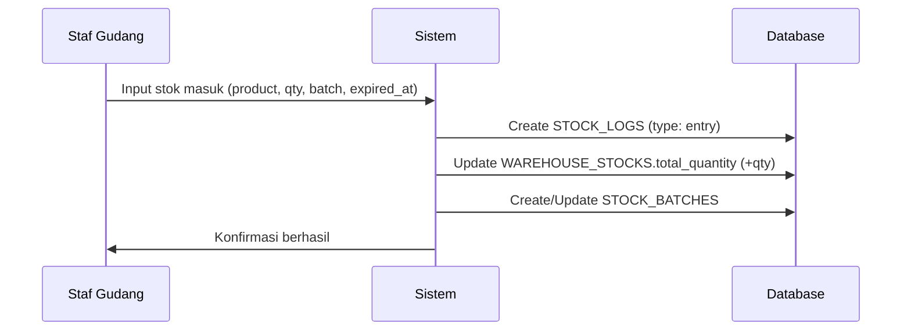
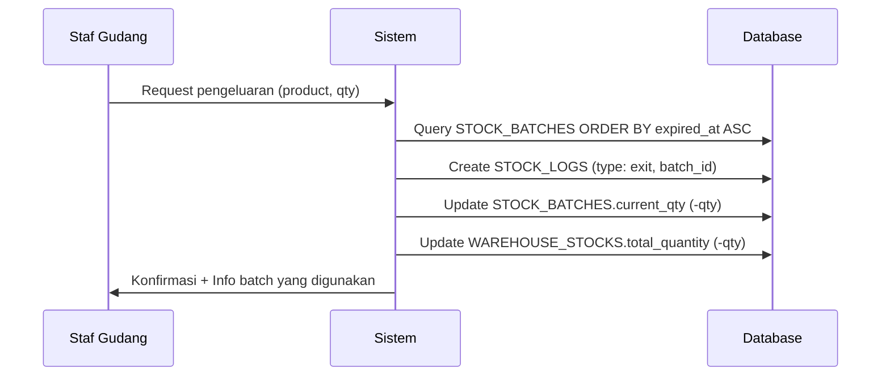
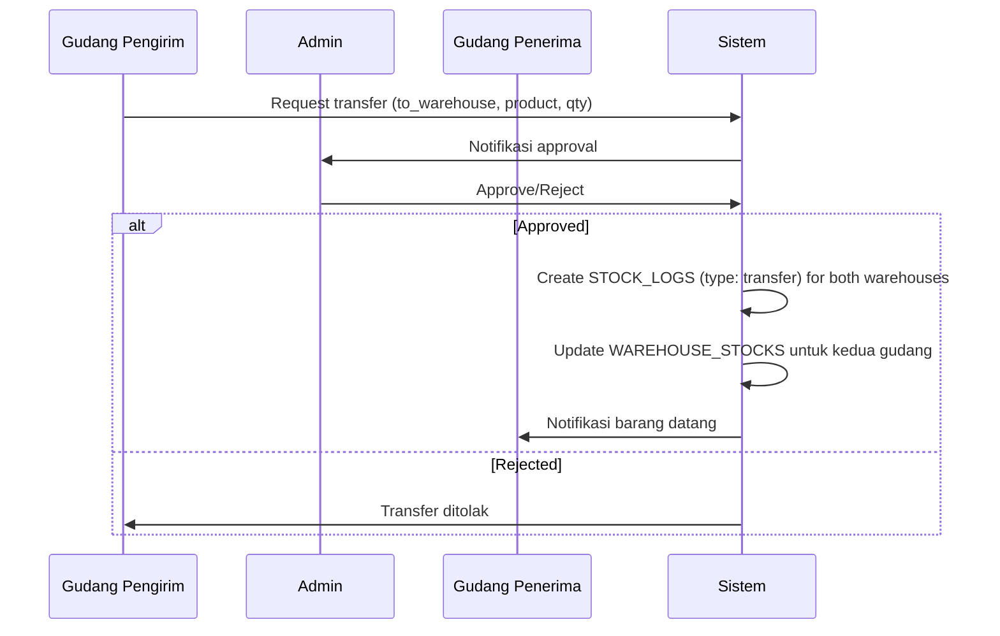
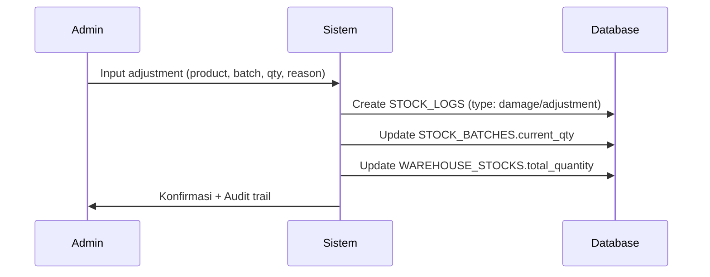

.# gudangKu - Sistem Manajemen Gudang Multi-Lokasi


Sistem manajemen inventori internal untuk **PT. Rizquna Berkah Mandiri (RBM)** yang dirancang khusus untuk mengelola banyak gudang, memantau tanggal kedaluwarsa produk susu menggunakan metode **FEFO (First Expired First Out)**, dan menyediakan audit trail yang lengkap.

## 📋 Daftar Isi

- [Fitur Utama](#-fitur-utama)
- [Technology Stack](#-technology-stack)
- [Arsitektur Sistem](#-arsitektur-sistem)
- [Entity Relationship Diagram](#-entity-relationship-diagram)
- [Instalasi](#-instalasi)
- [Konfigurasi](#-konfigurasi)
- [Alur Kerja Sistem](#-alur-kerja-sistem)
- [Testing](#-testing)
- [Kontribusi](#-kontribusi)

## ✨ Fitur Utama

### 🔐 Manajemen Pengguna & Akses
- **Role-Based Access Control** terintegrasi dengan Spatie Laravel Permission
- 3 Level akses: Super Admin, Admin, dan Viewer
- Penugasan staf ke gudang tertentu melalui `warehouse_users`
- Autentikasi menggunakan Laravel Fortify

### 📦 Manajemen Multi-Gudang
- Kelola banyak gudang dalam satu sistem terpusat
- Tracking stok per gudang dan per produk
- Transfer stok antar gudang dengan approval workflow
- Real-time monitoring ketersediaan stok

### 📅 FEFO (First Expired First Out)
- Tracking batch number dengan tanggal kedaluwarsa
- Peringatan otomatis untuk produk yang mendekati expired
- Prioritas pengeluaran berdasarkan tanggal expired
- Status batch: Available, Warning, Expired

### 📊 Audit Trail Lengkap
- Pencatatan semua mutasi stok (masuk, keluar, transfer, adjustment, kerusakan)
- Tracking user yang melakukan transaksi
- Riwayat lengkap per produk, batch, dan gudang
- Laporan komprehensif untuk analisis

### 📱 User Interface Modern
- Responsive design dengan Tailwind CSS 4
- Single Page Application menggunakan Inertia.js + React
- Real-time updates dan seamless navigation
- Dark mode support

## 🛠 Technology Stack

### Backend
- **Laravel 12** - PHP Framework
- **Laravel Fortify** - Authentication
- **Spatie Laravel Permission** - Role & Permission Management
- **PHP 8.3** - Programming Language

### Frontend
- **React 19** - UI Library
- **Inertia.js v2** - Modern Monolith
- **TypeScript** - Type Safety
- **Tailwind CSS 4** - Styling
- **Laravel Wayfinder** - Type-safe routing

### Development Tools
- **Pest 4** - Testing Framework
- **Laravel Pint** - Code Style Fixer
- **ESLint 9** - JavaScript Linter
- **Prettier 3** - Code Formatter
- **Vite** - Frontend Build Tool

## 🏗 Arsitektur Sistem

Sistem ini menggunakan arsitektur monolith modern dengan Inertia.js yang menggabungkan keunggulan server-side rendering dan client-side interactivity.

```
┌─────────────────────────────────────────────────────┐
│                   Browser/Client                     │
│            (React + TypeScript + Inertia)            │
└──────────────────────┬──────────────────────────────┘
                       │ JSON/Props
┌──────────────────────┴──────────────────────────────┐
│              Laravel Application                     │
│  ┌─────────────────────────────────────────────┐   │
│  │         Inertia Middleware                  │   │
│  └─────────────────────────────────────────────┘   │
│  ┌─────────────────────────────────────────────┐   │
│  │    Controllers & Business Logic             │   │
│  └─────────────────────────────────────────────┘   │
│  ┌─────────────────────────────────────────────┐   │
│  │    Eloquent Models & Relationships          │   │
│  └─────────────────────────────────────────────┘   │
└──────────────────────┬──────────────────────────────┘
                       │
┌──────────────────────┴──────────────────────────────┐
│              MySQL Database                          │
└─────────────────────────────────────────────────────┘
```

## 📊 Entity Relationship Diagram (ERD)

### 1. Kelompok Pengguna & Akses (Spatie Integrated)

#### **USERS**
```
- id (PK)
- name
- email (unique)
- password
- deleted_at (soft delete)
- created_at
- updated_at
```

**Relasi:**
- users ↔ roles (Spatie `MODEL_HAS_ROLES`)
- users ↔ warehouses (via `warehouse_users`)
- users → stock_logs (1:N)
- users → stock_transfers (1:N)

---

#### **ROLES** (Spatie)
```
- id (PK)
- name (super-admin, admin, viewer)
- guard_name
```

---

#### **MODEL_HAS_ROLES** (Spatie Pivot)
```
- role_id (FK -> roles.id)
- model_id (FK -> users.id)
- model_type (App\Models\User)
```

---

#### **WAREHOUSE_USERS** (Penugasan staf ke gudang)
```
- id (PK)
- warehouse_id (FK -> warehouses.id)
- user_id (FK -> users.id)
- deleted_at (soft delete)
- created_at
- updated_at

UNIQUE(warehouse_id, user_id)
```

---

### 2. Kelompok Master Data & Katalog

#### **WAREHOUSES**
```
- id (PK)
- name (varchar)
- address (text)
- deleted_at (soft delete)
- created_at
- updated_at
```

**Relasi:**
- warehouses → warehouse_users (1:N)
- warehouses → warehouse_stocks (1:N)
- warehouses → stock_logs (1:N)
- warehouses → stock_transfers (1:N, as from/to)

---

#### **CATEGORIES**
```
- id (PK)
- name (Contoh: UHT, Fullcream, Plain)
- slug (unique)
- deleted_at (soft delete)
- created_at
- updated_at
```

**Relasi:**
- categories → products (1:N)

---

#### **PRODUCTS**
```
- id (PK)
- category_id (FK -> categories.id)
- name (varchar)
- brand (varchar)
- unit (varchar) (Contoh: Karton, Box, Pcs)
- sku (varchar, unique)
- deleted_at (soft delete)
- created_at
- updated_at
```

**Relasi:**
- products → product_prices (1:N)
- products → warehouse_stocks (1:N)
- products → stock_logs (1:N)
- products → stock_transfers (1:N)

---

#### **PRODUCT_PRICES** (Tracking harga historis)
```
- id (PK)
- product_id (FK -> products.id)
- cost_price (decimal)
- selling_price (decimal)
- effective_from (date)
- created_at
- updated_at
```

**Catatan:** Untuk laporan keuangan dan analisis profit margin.

---

### 3. Kelompok Inventori & Stok Multi-Gudang

#### **WAREHOUSE_STOCKS**
```
- id (PK)
- warehouse_id (FK -> warehouses.id)
- product_id (FK -> products.id)
- total_quantity (integer, default: 0)
- created_at
- updated_at

UNIQUE(warehouse_id, product_id)
```

**Relasi:**
- warehouse_stocks → stock_batches (1:N)

---

#### **STOCK_BATCHES** (FEFO Core)
```
- id (PK)
- warehouse_stock_id (FK -> warehouse_stocks.id)
- batch_number (varchar)
- expired_at (date)
- current_qty (integer)
- cost_price (decimal) // Harga modal per batch
- is_active (boolean, default: true)
- status (enum: available, expired, warning)
- created_at
- updated_at
```

**Relasi:**
- stock_batches → stock_logs (1:N)

---

### 4. Kelompok Mutasi & Audit Trail

#### **STOCK_TRANSFERS**
```
- id (PK)
- from_warehouse_id (FK -> warehouses.id)
- to_warehouse_id (FK -> warehouses.id)
- product_id (FK -> products.id)
- qty (integer)
- user_id (FK -> users.id)
- status (enum: pending, completed, rejected)
- notes (text, nullable)
- created_at
- updated_at
```

---

#### **STOCK_LOGS** (Audit Trail)
```
- id (PK)
- warehouse_id (FK -> warehouses.id)
- product_id (FK -> products.id)
- batch_id (FK -> stock_batches.id, nullable)
- user_id (FK -> users.id)
- qty (integer) // (+) masuk, (-) keluar/rusak
- type (enum: entry, exit, transfer, adjustment, damage)
- notes (text, nullable)
- created_at

⚠️ TIDAK boleh soft delete (permanent audit)
```

---

### Relasi Antar Tabel (Summary)

```
USERS 1:N WAREHOUSE_USERS N:1 WAREHOUSES
USERS N:M ROLES (via MODEL_HAS_ROLES)
USERS 1:N STOCK_LOGS
USERS 1:N STOCK_TRANSFERS

CATEGORIES 1:N PRODUCTS
PRODUCTS 1:N PRODUCT_PRICES
PRODUCTS N:M WAREHOUSES (via WAREHOUSE_STOCKS)
PRODUCTS 1:N STOCK_LOGS
PRODUCTS 1:N STOCK_TRANSFERS

WAREHOUSES 1:N WAREHOUSE_STOCKS
WAREHOUSES 1:N STOCK_LOGS
WAREHOUSES 1:N STOCK_TRANSFERS (as from/to)

WAREHOUSE_STOCKS 1:N STOCK_BATCHES
STOCK_BATCHES 1:N STOCK_LOGS
```

---

## 🔢 Urutan Migration (WAJIB IKUTI)

Untuk menghindari foreign key constraint error, migration harus dijalankan dalam urutan ini:

1. `create_users_table` (Laravel default)
2. `create_cache_table` (Laravel default)
3. `create_jobs_table` (Laravel default)
4. `create_permission_tables` (Spatie - roles, model_has_roles)
5. `create_warehouses_table`
6. `create_warehouse_users_table`
7. `create_categories_table`
8. `create_products_table`
9. `create_product_prices_table` ⭐ NEW
10. `create_warehouse_stocks_table`
11. `create_stock_batches_table`
12. `create_stock_transfers_table`
13. `create_stock_logs_table`

**Cara Membuat Migration dengan Urutan Benar:**
```bash
# Gunakan timestamp manual atau buat satu per satu dengan delay
php artisan make:migration create_warehouses_table
sleep 1
php artisan make:migration create_warehouse_users_table
sleep 1
# dst...
```

---

## 📝 Contoh Migration Kritis

### Migration: warehouses

```php
<?php

use Illuminate\Database\Migrations\Migration;
use Illuminate\Database\Schema\Blueprint;
use Illuminate\Support\Facades\Schema;

return new class extends Migration
{
    public function up(): void
    {
        Schema::create('warehouses', function (Blueprint $table) {
            $table->id();
            $table->string('name');
            $table->text('address');
            $table->softDeletes();
            $table->timestamps();
        });
    }

    public function down(): void
    {
        Schema::dropIfExists('warehouses');
    }
};
```

---

### Migration: products

```php
<?php

use Illuminate\Database\Migrations\Migration;
use Illuminate\Database\Schema\Blueprint;
use Illuminate\Support\Facades\Schema;

return new class extends Migration
{
    public function up(): void
    {
        Schema::create('products', function (Blueprint $table) {
            $table->id();
            $table->foreignId('category_id')->constrained()->onDelete('cascade');
            $table->string('name');
            $table->string('brand');
            $table->string('unit');
            $table->string('sku')->unique();
            $table->softDeletes();
            $table->timestamps();
        });
    }

    public function down(): void
    {
        Schema::dropIfExists('products');
    }
};
```

---

### Migration: product_prices (NEW)

```php
<?php

use Illuminate\Database\Migrations\Migration;
use Illuminate\Database\Schema\Blueprint;
use Illuminate\Support\Facades\Schema;

return new class extends Migration
{
    public function up(): void
    {
        Schema::create('product_prices', function (Blueprint $table) {
            $table->id();
            $table->foreignId('product_id')->constrained()->onDelete('cascade');
            $table->decimal('cost_price', 15, 2);
            $table->decimal('selling_price', 15, 2);
            $table->date('effective_from');
            $table->timestamps();
            
            $table->index(['product_id', 'effective_from']);
        });
    }

    public function down(): void
    {
        Schema::dropIfExists('product_prices');
    }
};
```

---

### Migration: warehouse_stocks

```php
<?php

use Illuminate\Database\Migrations\Migration;
use Illuminate\Database\Schema\Blueprint;
use Illuminate\Support\Facades\Schema;

return new class extends Migration
{
    public function up(): void
    {
        Schema::create('warehouse_stocks', function (Blueprint $table) {
            $table->id();
            $table->foreignId('warehouse_id')->constrained()->onDelete('cascade');
            $table->foreignId('product_id')->constrained()->onDelete('cascade');
            $table->integer('total_quantity')->default(0);
            $table->timestamps();

            $table->unique(['warehouse_id', 'product_id']);
        });
    }

    public function down(): void
    {
        Schema::dropIfExists('warehouse_stocks');
    }
};
```

---

### Migration: stock_batches

```php
<?php

use Illuminate\Database\Migrations\Migration;
use Illuminate\Database\Schema\Blueprint;
use Illuminate\Support\Facades\Schema;

return new class extends Migration
{
    public function up(): void
    {
        Schema::create('stock_batches', function (Blueprint $table) {
            $table->id();
            $table->foreignId('warehouse_stock_id')->constrained()->onDelete('cascade');
            $table->string('batch_number');
            $table->date('expired_at');
            $table->integer('current_qty')->default(0);
            $table->decimal('cost_price', 15, 2);
            $table->boolean('is_active')->default(true);
            $table->enum('status', ['available', 'expired', 'warning'])->default('available');
            $table->timestamps();
            
            $table->index(['warehouse_stock_id', 'expired_at']);
        });
    }

    public function down(): void
    {
        Schema::dropIfExists('stock_batches');
    }
};
```

---

### Migration: stock_logs (AUDIT TRAIL - NO SOFT DELETE)

```php
<?php

use Illuminate\Database\Migrations\Migration;
use Illuminate\Database\Schema\Blueprint;
use Illuminate\Support\Facades\Schema;

return new class extends Migration
{
    public function up(): void
    {
        Schema::create('stock_logs', function (Blueprint $table) {
            $table->id();
            $table->foreignId('warehouse_id')->constrained()->onDelete('cascade');
            $table->foreignId('product_id')->constrained()->onDelete('cascade');
            $table->foreignId('batch_id')->nullable()->constrained('stock_batches')->onDelete('set null');
            $table->foreignId('user_id')->constrained()->onDelete('cascade');
            $table->integer('qty'); // (+) masuk, (-) keluar
            $table->enum('type', ['entry', 'exit', 'transfer', 'adjustment', 'damage']);
            $table->text('notes')->nullable();
            $table->timestamps(); // created_at untuk audit timestamp
            
            // ⚠️ NO softDeletes() - audit trail harus permanen
        });
    }

    public function down(): void
    {
        Schema::dropIfExists('stock_logs');
    }
};
```

## 🚀 Instalasi

### Prasyarat

- PHP 8.3 atau lebih tinggi
- Composer 2.x
- Node.js 18+ dan NPM/Yarn
- MySQL 8.0+
- Git

### Langkah Instalasi

1. **Clone Repository**
```bash
git clone <repository-url> gudangku
cd gudangku
```

2. **Install Dependencies Backend**
```bash
composer install
```

3. **Install Dependencies Frontend**
```bash
npm install
```

4. **Environment Configuration**
```bash
cp .env.example .env
php artisan key:generate
```

5. **Database Setup**

Edit file `.env` sesuai dengan konfigurasi database Anda:
```env
DB_CONNECTION=mysql
DB_HOST=127.0.0.1
DB_PORT=3306
DB_DATABASE=gudangku
DB_USERNAME=root
DB_PASSWORD=
```

Jalankan migration dan seeder:
```bash
php artisan migrate --seed
```

6. **Build Assets**

Development:
```bash
npm run dev
```

Production:
```bash
npm run build
```

7. **Jalankan Aplikasi**

Menggunakan Laravel development server:
```bash
php artisan serve
```

Atau menggunakan Laravel Sail (Docker):
```bash
./vendor/bin/sail up
```

Aplikasi akan berjalan di `http://localhost:8000`

## ⚙️ Konfigurasi

### Role & Permission Default

Setelah instalasi, sistem akan membuat 3 role default:

1. **Super Admin** - Akses penuh ke seluruh sistem
2. **Admin** - Manajemen stok, produk, dan gudang
3. **Viewer** - Hanya dapat melihat data (read-only)

### User Default

```
Email: admin@rbm.com
Password: password
Role: Super Admin
```

**PENTING:** Segera ubah password default setelah instalasi pertama!

### Laravel Boost (MCP Server)

Proyek ini sudah terintegrasi dengan Laravel Boost untuk development experience yang lebih baik:

```bash
php artisan boost:install
```

## 🔄 Alur Kerja Sistem

### 1. Setup Awal

```
Super Admin → Buat Kategori Produk → Buat Produk → Buat Gudang → Assign User ke Gudang
```

### 2. Stock Entry (Barang Masuk)



### 3. Stock Exit (Barang Keluar) - FEFO



### 4. Transfer Antar Gudang



### 5. Stock Adjustment (Kerusakan/Penyesuaian)



### 6. Monitoring Expired (Automated)

Sistem secara otomatis menjalankan scheduler untuk:
- Update `STOCK_BATCHES.status` berdasarkan `expired_at`
- Kirim notifikasi untuk produk yang akan expired dalam 30 hari
- Update status batch yang sudah expired menjadi inactive

```php
// Scheduled daily
php artisan schedule:work
```

## 🏗️ Development Workflow

### 📋 Urutan Pengerjaan (Development Roadmap)

Ikuti urutan ini untuk membangun sistem secara sistematis:

#### **FASE 1: Foundation & Authentication** ✅ (Sudah selesai)
- [x] Setup Laravel 12 + Inertia + React
- [x] Instalasi Laravel Fortify
- [x] Instalasi Spatie Laravel Permission
- [x] Setup Authentication UI

#### **FASE 2: Master Data & Roles** 🎯 (Mulai dari sini!)

### 🏃 SPRINT 1: Foundation & Roles (Estimasi: 2-3 hari)

**Step 1: Setup Roles & Permissions**
```bash
# Buat seeder untuk roles
php artisan make:seeder RoleSeeder

# Buat seeder untuk super admin user
php artisan make:seeder SuperAdminSeeder
```

Edit `database/seeders/RoleSeeder.php`:
```php
use Spatie\Permission\Models\Role;

Role::create(['name' => 'super-admin']);
Role::create(['name' => 'admin']);
Role::create(['name' => 'viewer']);
```

Jalankan seeder:
```bash
php artisan db:seed --class=RoleSeeder
php artisan db:seed --class=SuperAdminSeeder
```

---

### 🏃 SPRINT 2: Master Data - Categories (Estimasi: 1-2 hari)

**PERINTAH LENGKAP:**
```bash
# Model + Migration + Controller Resource + Factory
php artisan make:model Category -mcrf

# Requests
php artisan make:request Categories/StoreCategoryRequest
php artisan make:request Categories/UpdateCategoryRequest

# Policy
php artisan make:policy CategoryPolicy --model=Category

# Seeder
php artisan make:seeder CategorySeeder

# Factory sudah dibuat, update jika perlu
```

**DELIVERABLES:**
- ✅ CRUD Categories lengkap dengan soft delete
- ✅ Validation (name, slug unique)
- ✅ Policy untuk role-based access
- ✅ Factory dengan data dummy yang realistis
- ✅ Seeder dengan 5-10 kategori produk susu

---

### 🏃 SPRINT 3: Master Data - Products (Estimasi: 2-3 hari)

**PERINTAH LENGKAP:**
```bash
# Model + Migration + Controller Resource + Factory
php artisan make:model Product -mcrf

# Requests
php artisan make:request Products/StoreProductRequest
php artisan make:request Products/UpdateProductRequest

# Policy
php artisan make:policy ProductPolicy --model=Product

# Seeder
php artisan make:seeder ProductSeeder

# Factory sudah dibuat, update jika perlu
```

**DELIVERABLES:**
- ✅ CRUD Products dengan relasi ke Categories
- ✅ SKU auto-generate atau manual input
- ✅ Validation (sku unique, category_id exists)
- ✅ Factory dengan brand & unit yang realistis
- ✅ Seeder dengan 20-30 produk susu

---

### 🏃 SPRINT 4: Master Data - Warehouses (Estimasi: 2-3 hari)

**⚠️ SUDAH DIBUAT, TINGGAL LENGKAPI:**
```bash
# Seeder & Factory
php artisan make:seeder WarehouseSeeder
php artisan make:factory WarehouseFactory --model=Warehouse
```

**DELIVERABLES:**
- ✅ CRUD Warehouses dengan soft delete
- ✅ Policy untuk super-admin only create/update
- ✅ Factory dengan alamat realistis
- ✅ Seeder dengan 3-5 gudang

---

### 🏃 SPRINT 5: Pivot Table - Warehouse Users (Estimasi: 1 hari)

**PERINTAH LENGKAP:**
```bash
# Model + Migration
php artisan make:model WarehouseUser -mf

# Factory
# (Sudah dibuat dengan flag -f di atas)

# Seeder
php artisan make:seeder WarehouseUserSeeder

# Policy (optional, bisa di WarehousePolicy)
php artisan make:policy WarehouseUserPolicy --model=WarehouseUser
```

**DELIVERABLES:**
- ✅ Relasi M:N antara User & Warehouse
- ✅ UNIQUE constraint (warehouse_id, user_id)
- ✅ Factory untuk testing
- ✅ Seeder untuk assign admin ke gudang

---

### 🏃 SPRINT 6: Product Pricing (Estimasi: 1-2 hari)

**PERINTAH LENGKAP:**
```bash
# Model + Migration + Factory
php artisan make:model ProductPrice -mf

# Controller (optional, bisa nested di ProductController)
php artisan make:controller Products/ProductPriceController --resource

# Requests
php artisan make:request Products/StoreProductPriceRequest
php artisan make:request Products/UpdateProductPriceRequest

# Seeder
php artisan make:seeder ProductPriceSeeder
```

**DELIVERABLES:**
- ✅ Tracking harga historis per produk
- ✅ effective_from untuk versioning
- ✅ Factory dengan harga realistis (10k-50k)
- ✅ Seeder untuk set harga awal semua produk

---

#### **FASE 3: Inventori & FEFO System** 📦

### 🏃 SPRINT 7: Warehouse Stocks (Estimasi: 1-2 hari)

**PERINTAH LENGKAP:**
```bash
# Model + Migration + Factory
php artisan make:model WarehouseStock -mf

# Controller (resource)
php artisan make:controller Warehouses/WarehouseStockController --resource

# Policy
php artisan make:policy WarehouseStockPolicy --model=WarehouseStock

# Seeder
php artisan make:seeder WarehouseStockSeeder
```

**DELIVERABLES:**
- ✅ Tabel pivot dengan total_quantity
- ✅ UNIQUE constraint (warehouse_id, product_id)
- ✅ Policy untuk admin hanya akses gudang yang di-assign
- ✅ Factory & Seeder dengan stok awal realistic

---

### 🏃 SPRINT 8: Stock Batches - FEFO Core (Estimasi: 3-4 hari)

**PERINTAH LENGKAP:**
```bash
# Model + Migration + Controller + Factory
php artisan make:model StockBatch -mcrf

# Requests
php artisan make:request StockBatches/StoreStockBatchRequest
php artisan make:request StockBatches/UpdateStockBatchRequest

# Policy
php artisan make:policy StockBatchPolicy --model=StockBatch

# Seeder
php artisan make:seeder StockBatchSeeder

# Command untuk auto-expire
php artisan make:command CheckExpiredBatches
```

**DELIVERABLES:**
- ✅ CRUD Stock Batches dengan FEFO logic
- ✅ Status: available, warning, expired
- ✅ Command untuk update status batch otomatis
- ✅ Factory dengan expired_at varied (past, near, future)
- ✅ Seeder dengan 50-100 batch realistis

---

### 🏃 SPRINT 9: Service Layer - Business Logic (Estimasi: 3-5 hari)

**PERINTAH LENGKAP:**
```bash
# Buat direktori services (PowerShell)
New-Item -ItemType Directory -Path app/Services -Force

# Buat service files (PowerShell)
New-Item -ItemType File -Path app/Services/StockService.php
New-Item -ItemType File -Path app/Services/FefoService.php
New-Item -ItemType File -Path app/Services/TransferService.php

# Atau gunakan touch jika tersedia (Git Bash)
# mkdir -p app/Services
# touch app/Services/StockService.php
# touch app/Services/FefoService.php
# touch app/Services/TransferService.php

# Action untuk Stock In (Inertia pattern)
php artisan make:class Actions/StockBatches/StockInAction

# Action untuk Stock Out (Inertia pattern)
php artisan make:class Actions/StockBatches/StockOutAction
```

**DELIVERABLES:**
- ✅ `FefoService` → getNextBatch(), checkExpiringSoon()
- ✅ `StockService` → addStock(), reduceStock()
- ✅ `TransferService` → initiateTransfer(), approveTransfer()
- ✅ Semua service dengan DB::transaction()
- ✅ Unit tests untuk setiap service method

Struktur `FefoService.php`:
```php
<?php

namespace App\Services;

use App\Models\StockBatch;
use Carbon\Carbon;

class FefoService
{
    /**
     * Ambil batch yang harus keluar duluan (First Expired First Out)
     */
    public function getNextBatch($warehouseStockId, $requiredQty)
    {
        return StockBatch::where('warehouse_stock_id', $warehouseStockId)
            ->where('is_active', true)
            ->where('status', 'available')
            ->where('current_qty', '>', 0)
            ->orderBy('expired_at', 'asc')
            ->first();
    }
    
    /**
     * Cek batch yang akan expired dalam X hari
     */
    public function checkExpiringSoon($days = 30)
    {
        return StockBatch::where('is_active', true)
            ->where('status', 'available')
            ->where('expired_at', '<=', Carbon::now()->addDays($days))
            ->where('expired_at', '>', Carbon::now())
            ->with(['warehouseStock.product', 'warehouseStock.warehouse'])
            ->get();
    }
}
```

---

#### **FASE 4: Mutasi & Audit Trail** 🔄

### 🏃 SPRINT 10: Stock Transfers (Estimasi: 3-4 hari)

**PERINTAH LENGKAP:**
```bash
# Model + Migration + Controller + Factory
php artisan make:model StockTransfer -mcrf

# Requests
php artisan make:request StockTransfers/StoreStockTransferRequest
php artisan make:request StockTransfers/UpdateStockTransferRequest
php artisan make:request StockTransfers/ApproveStockTransferRequest
php artisan make:request StockTransfers/RejectStockTransferRequest

# Policy
php artisan make:policy StockTransferPolicy --model=StockTransfer

# Seeder
php artisan make:seeder StockTransferSeeder

# Actions
php artisan make:class Actions/StockTransfers/InitiateTransferAction
php artisan make:class Actions/StockTransfers/ApproveTransferAction
php artisan make:class Actions/StockTransfers/RejectTransferAction
```

**DELIVERABLES:**
- ✅ CRUD Transfer dengan status: pending, completed, rejected
- ✅ Approval workflow untuk admin/super-admin
- ✅ Notification untuk gudang penerima
- ✅ Factory dengan status varied
- ✅ Integration test untuk transfer flow

---

### 🏃 SPRINT 11: Stock Logs - Audit Trail (Estimasi: 2-3 hari)

**PERINTAH LENGKAP:**
```bash
# Model + Migration + Factory (NO Controller, NO Soft Delete)
php artisan make:model StockLog -mf

# Observer untuk auto-logging
php artisan make:observer StockLogObserver --model=StockLog

# Seeder
php artisan make:seeder StockLogSeeder

# Report/Query Builder (optional)
php artisan make:class Services/ReportService
```

**DELIVERABLES:**
- ✅ Audit trail untuk semua mutasi stok
- ✅ Type: entry, exit, transfer, adjustment, damage
- ✅ Observer untuk logging otomatis
- ✅ Factory dengan tipe varied
- ✅ Seeder dengan 200+ log entries
- ⚠️ **TIDAK ADA soft delete** (permanent audit)

---

### 🏃 SPRINT 12: Concerns & Traits (Estimasi: 1 hari)

**PERINTAH LENGKAP:**
```bash
# Concerns untuk Models
php artisan makTesting & Quality Assurance** 🧪

### 🏃 SPRINT 14: Testing Comprehensive (Estimasi: 3-5 hari)

**PERINTAH LENGKAP:**
```bash
# Feature Tests (dengan Pest)
php artisan make:test Feature/Categories/CategoryTest --pest
php artisan make:test Feature/Products/ProductTest --pest
php artisan make:test Feature/Products/ProductPriceTest --pest
php artisan make:test Feature/Warehouses/WarehouseTest --pest
php artisan make:test Feature/Warehouses/WarehouseStockTest --pest
php artisan make:test Feature/StockBatches/StockBatchTest --pest
php artisan make:test Feature/StockBatches/FefoTest --pest
php artisan make:test Feature/StockTransfers/StockTransferTest --pest
php artisan make:test Feature/StockLogs/StockLogTest --pest

# Unit Tests
php artisan make:test Unit/Services/FefoServiceTest --pest --unit
php artisan make:test Unit/Services/StockServiceTest --pest --unit
php artisan make:test Unit/Services/TransferServiceTest --pest --unit
php artisan make:test Unit/Policies/WarehouseAccessTest --pest --unit

# Browser Tests (Dusk - optional)
php artisan dusk:make StockInFlowTest
php artisan dusk:make StockOutFlowTest
php artisan dusk:make TransferApprovalFlowTest
```

**DELIVERABLES:**
- ✅ Feature tests untuk semua CRUD operations
- ✅ Unit tests untuk service layer
- ✅ Policy tests untuk authorization
- ✅ FEFO logic tests dengan multiple scenarios
- ✅ Integration tests untuk transfer workflow
- ✅ Test coverage minimum 80%

---

### 🏃 SPRINT 15: Seeding & Demo Data (Estimasi: 1-2 hari)

**Update DatabaseSeeder.php:**
```php
public function run(): void
{
    $this->call([
        RoleSeeder::class,              // Sprint 1
        SuperAdminSeeder::class,        // Sprint 1
        CategorySeeder::class,          // Sprint 2
        ProductSeeder::class,           // Sprint 3
        WarehouseSeeder::class,         // Sprint 4
        WarehouseUserSeeder::class,     // Sprint 5
        ProductPriceSeeder::class,      // Sprint 6
        WarehouseStockSeeder::class,    // Sprint 7
        StockBatchSeeder::class,        // Sprint 8
        StockTransferSeeder::class,     // Sprint 10
        StockLogSeeder::class,          // Sprint 11
    ]);
}
```

**Jalankan Seeding:**
```bash
# Fresh migration dengan seeding
php artisan migrate:fresh --seed

# Atau seeder individual
php artisan db:seed --class=CategorySeeder
```

**DELIVERABLES:**
- ✅ Data dummy lengkap untuk development
- ✅ Relasi antar tabel sudah ter-seed
- ✅ Stock batches dengan status varied
- ✅ Stock transfers dengan status pending/completed
- ✅ Stock logs untuk audit trail
- ✅ Demo users untuk setiap roletep 11: Command untuk Auto-Expire**
```bash
php artisan make:command CheckExpiredBatches
```

Edit `app/Console/Commands/CheckExpiredBatches.php`:
```php
<?php

namespace App\Console\Commands;

use App\Models\StockBatch;
use Carbon\Carbon;
use Illuminate\Console\Command;

class CheckExpiredBatches extends Command
{
    protected $signature = 'batches:check-expired';
    protected $description = 'Check and update expired batches status';

    public function handle()
    {
        $expired = StockBatch::where('expired_at', '<', Carbon::now())
            ->where('status', '!=', 'expired')
            ->update([
                'status' => 'expired',
                'is_active' => false
            ]);

        $warning = StockBatch::where('expired_at', '<=', Carbon::now()->addDays(30))
            ->where('expired_at', '>', Carbon::now())
            ->where('status', 'available')
            ->update(['status' => 'warning']);

        $this->info("Updated {$expired} expired batches");
        $this->info("Updated {$warning} warning batches");
    }
}
```

Daftarkan di `routes/console.php`:
```php
use Illuminate\Support\Facades\Schedule;

Schedule::command('batches:check-expired')->daily();
```

---

#### **FASE 6: Seeding & Testing** 🌱

**Step 12: Buat Seeders**
```bash
php artisan make:seeder WarehouseSeeder
php artisan make:seeder CategorySeeder
php artisan make:seeder ProductSeeder
```

**Step 13: Buat Factory & Tests**
```bash
# Update factories untuk setiap model
# Buat feature tests
php artisan make:test CategoryTest --pest
php artisan make:test ProductTest --pest
php artisan make:test WarehouseTest --pest
php artisan make:test StockBatchTest --pest
php artisan make:test StockTransferTest --pest
```

---

### 🏛️ Arsitektur Sistem (Detail)

#### **1️⃣ USER & AKSES (Spatie + Fortify)**

**User Model** - Default Laravel, tidak perlu dibuat ulang
```
Model: App\Models\User (sudah ada)
```

**Roles & Permissions**
```php
// Sudah terintegrasi dengan Spatie Laravel Permission
// 3 Role utama:
- super-admin → Full access
- admin → Terbatas per gudang (via warehouse_users)
- viewer → Read-only access
```

**Policy untuk Akses Gudang**
```bash
php artisan make:policy WarehousePolicy --model=Warehouse
```

Contoh implementasi di `WarehousePolicy.php`:
```php
public function viewAny(User $user)
{
    return $user->hasRole('super-admin') || $user->hasRole('admin');
}

public function view(User $user, Warehouse $warehouse)
{
    if ($user->hasRole('super-admin')) {
        return true;
    }
    
    // Admin hanya bisa akses gudang yang di-assign
    return $user->warehouseUsers()
        ->where('warehouse_id', $warehouse->id)
        ->exists();
}

public function create(User $user)
{
    return $user->hasRole('super-admin');
}

public function update(User $user, Warehouse $warehouse)
{
    return $user->hasRole('super-admin');
}
```

---

#### **2️⃣ MASTER DATA**

**Categories**
```
Model: App\Models\Category
Controller: App\Http\Controllers\CategoryController
Requests: StoreCategoryRequest, UpdateCategoryRequest
Policy: CategoryPolicy
```

**Products**
```
Model: App\Models\Product
Controller: App\Http\Controllers\ProductController
Requests: StoreProductRequest, UpdateProductRequest
Policy: ProductPolicy
```

**Warehouses**
```
Model: App\Models\Warehouse
Controller: App\Http\Controllers\WarehouseController
Requests: StoreWarehouseRequest, UpdateWarehouseRequest
Policy: WarehousePolicy
```

**Warehouse Users (Pivot)**
```
Model: App\Models\WarehouseUser
Migration: create_warehouse_users_table
```

---

#### **3️⃣ INVENTORI & FEFO**

**Warehouse Stocks**
```
Model: App\Models\WarehouseStock
Policy: WarehouseStockPolicy
```

**Stock Batches (FEFO Core)**
```
Model: App\Models\StockBatch
Controller: App\Http\Controllers\StockBatchController
Requests: StoreStockBatchRequest, UpdateStockBatchRequest
Policy: StockBatchPolicy
```

**⚠️ FEFO Logic → Service/Repository, BUKAN Controller!**

---

#### **4️⃣ MUTASI & AUDIT TRAIL**

**Stock Transfers**
```
Model: App\Models\StockTransfer
Controller: App\Http\Controllers\StockTransferController
Requests: StoreStockTransferRequest, UpdateStockTransferRequest
Policy: StockTransferPolicy
```

**Stock Logs (Audit)**
```
Model: App\Models\StockLog
Migration: create_stock_logs_table
```

---

#### **5️⃣ POLICY RULES (WAJIB UNTUK ROLE & GUDANG)**

```bash
php artisan make:policy ProductPolicy --model=Product
php artisan make:policy WarehouseStockPolicy --model=WarehouseStock
php artisan make:policy StockBatchPolicy --model=StockBatch
php artisan make:policy StockTransferPolicy --model=StockTransfer
```

**📌 Contoh Rule Inti:**

```php
// super-admin → allow all
if ($user->hasRole('super-admin')) {
    return true;
}

// admin → allow jika user ada di warehouse_users
if ($user->hasRole('admin')) {
    return $user->warehouseUsers()
        ->where('warehouse_id', $warehouse->id)
        ->exists();
}

// viewer → view only
if ($user->hasRole('viewer')) {
    return false; // Untuk action: create, update, delete
}
```

---

#### **6️⃣ SERVICE LAYER (REKOMENDASI KERAS)**

**Biar controller tipis & aman:**

```bash
mkdir app/Services
touch app/Services/StockService.php
touch app/Services/FefoService.php
touch app/Services/TransferService.php
```

**Fungsi Utama:**

- `StockService` → Tambah/kurang stok
- `FefoService` → Ambil batch terdekat expired
- `TransferService` → Mutasi + rollback aman

**Contoh `StockService.php`:**
```php
<?php

namespace App\Services;

use App\Models\StockLog;
use App\Models\WarehouseStock;
use App\Models\StockBatch;
use Illuminate\Support\Facades\DB;

class StockService
{
    public function __construct(
        private FefoService $fefoService
    ) {}
    
    /**
     * Tambah stok (Entry)
     */
    public function addStock($warehouseId, $productId, $qty, $batchNumber, $expiredAt, $userId)
    {
        return DB::transaction(function () use ($warehouseId, $productId, $qty, $batchNumber, $expiredAt, $userId) {
            // 1. Update atau buat warehouse stock
            $warehouseStock = WarehouseStock::firstOrCreate(
                ['warehouse_id' => $warehouseId, 'product_id' => $productId],
                ['total_quantity' => 0]
            );
            
            $warehouseStock->increment('total_quantity', $qty);
            
            // 2. Buat atau update batch
            $batch = StockBatch::firstOrCreate(
                [
                    'warehouse_stock_id' => $warehouseStock->id,
                    'batch_number' => $batchNumber
                ],
                [
                    'expired_at' => $expiredAt,
                    'current_qty' => 0,
                    'is_active' => true,
                    'status' => 'available'
                ]
            );
            
            $batch->increment('current_qty', $qty);
            
            // 3. Catat di stock log (AUDIT TRAIL)
            StockLog::create([
                'warehouse_id' => $warehouseId,
                'product_id' => $productId,
                'batch_id' => $batch->id,
                'user_id' => $userId,
                'qty' => $qty, // POSITIF untuk masuk
                'type' => 'entry',
                'notes' => "Stock entry - Batch: {$batchNumber}"
            ]);
            
            return $batch;
        });
    }
    
    /**
     * Kurangi stok (Exit) dengan FEFO
     */
    public function reduceStock($warehouseId, $productId, $qty, $userId, $type = 'exit')
    {
        return DB::transaction(function () use ($warehouseId, $productId, $qty, $userId, $type) {
            $warehouseStock = WarehouseStock::where('warehouse_id', $warehouseId)
                ->where('product_id', $productId)
                ->firstOrFail();
            
            if ($warehouseStock->total_quantity < $qty) {
                throw new \Exception('Insufficient stock');
            }
            
            $remainingQty = $qty;
            
            // Ambil batch berdasarkan FEFO
            while ($remainingQty > 0) {
                $batch = $this->fefoService->getNextBatch($warehouseStock->id, $remainingQty);
                
                if (!$batch) {
                    throw new \Exception('No available batch found');
                }
                
                $deductQty = min($remainingQty, $batch->current_qty);
                
                // Update batch
                $batch->decrement('current_qty', $deductQty);
                
                if ($batch->current_qty === 0) {
                    $batch->update(['is_active' => false]);
                }
                
                // Log audit trail
                StockLog::create([
                    'warehouse_id' => $warehouseId,
                    'product_id' => $productId,
                    'batch_id' => $batch->id,
                    'user_id' => $userId,
                    'qty' => -$deductQty, // NEGATIF untuk keluar
                    'type' => $type,
                    'notes' => "Stock exit - Batch: {$batch->batch_number}"
                ]);
                
                $remainingQty -= $deductQty;
            }
            
            // Update total quantity
            $warehouseStock->decrement('total_quantity', $qty);
            
            return true;
        });
    }
}
```

---

## 📊 AGILE SPRINT SUMMARY

### 🎯 Sprint Planning Overview

| Sprint | Fokus | Estimasi | Dependencies |
|--------|-------|----------|--------------|
| Sprint 1 | Roles & Permissions | 2-3 hari | - |
| Sprint 2 | Categories | 1-2 hari | Sprint 1 |
| Sprint 3 | Products | 2-3 hari | Sprint 2 |
| Sprint 4 | Warehouses | 2-3 hari | Sprint 1 |
| Sprint 5 | Warehouse Users | 1 hari | Sprint 1, 4 |
| Sprint 6 | Product Pricing | 1-2 hari | Sprint 3 |
| Sprint 7 | Warehouse Stocks | 1-2 hari | Sprint 3, 4 |
| Sprint 8 | Stock Batches (FEFO) | 3-4 hari | Sprint 7 |
| Sprint 9 | Service Layer | 3-5 hari | Sprint 8 |
| Sprint 10 | Stock Transfers | 3-4 hari | Sprint 7, 9 |
| Sprint 11 | Stock Logs (Audit) | 2-3 hari | Sprint 8, 10 |
| Sprint 12 | Concerns & Traits | 1 hari | Sprint 11 |
| Sprint 13 | Automation | 2 hari | Sprint 8, 11 |
| Sprint 14 | Testing | 3-5 hari | Sprint 1-13 |
| Sprint 15 | Seeding & Demo | 1-2 hari | Sprint 1-13 |

**Total Estimasi:** 29-43 hari kerja (6-9 minggu)

---

### 🚀 Quick Start - Copy & Paste Commands Per Sprint

#### **Sprint 1-2: Foundation (4-5 hari)**
```bash
# Sprint 1: Roles & Permissions
php artisan make:seeder RoleSeeder
php artisan make:seeder SuperAdminSeeder

# Sprint 2: Categories (Complete Package)
php artisan make:model Category -mcrf
php artisan make:request Categories/StoreCategoryRequest
php artisan make:request Categories/UpdateCategoryRequest
php artisan make:policy CategoryPolicy --model=Category
php artisan make:seeder CategorySeeder
```

#### **Sprint 3-4: Master Data (4-6 hari)**
```bash
# Sprint 3: Products
php artisan make:model Product -mcrf
php artisan make:request Products/StoreProductRequest
php artisan make:request Products/UpdateProductRequest
php artisan make:policy ProductPolicy --model=Product
php artisan make:seeder ProductSeeder

# Sprint 4: Warehouses (Sudah punya Model, tinggal Factory & Seeder)
php artisan make:factory WarehouseFactory --model=Warehouse
php artisan make:seeder WarehouseSeeder
```

#### **Sprint 5-6: Relations & Pricing (2-4 hari)**
```bash
# Sprint 5: Warehouse Users (Pivot)
php artisan make:model WarehouseUser -mf
php artisan make:seeder WarehouseUserSeeder
php artisan make:policy WarehouseUserPolicy --model=WarehouseUser

# Sprint 6: Product Prices
php artisan make:model ProductPrice -mf
php artisan make:controller Products/ProductPriceController --resource
php artisan make:request Products/StoreProductPriceRequest
php artisan make:request Products/UpdateProductPriceRequest
php artisan make:seeder ProductPriceSeeder
```

#### **Sprint 7-8: Inventory Core (4-6 hari)**
```bash
# Sprint 7: Warehouse Stocks
php artisan make:model WarehouseStock -mf
php artisan make:controller Warehouses/WarehouseStockController --resource
php artisan make:policy WarehouseStockPolicy --model=WarehouseStock
php artisan make:seeder WarehouseStockSeeder

# Sprint 8: Stock Batches (FEFO Core)
php artisan make:model StockBatch -mcrf
php artisan make:request StockBatches/StoreStockBatchRequest
php artisan make:request StockBatches/UpdateStockBatchRequest
php artisan make:policy StockBatchPolicy --model=StockBatch
php artisan make:seeder StockBatchSeeder
php artisan make:command Batches/CheckExpiredBatches
```

#### **Sprint 9: Service Layer (3-5 hari) - Manual Creation**
```powershell
# PowerShell (Windows)
New-Item -ItemType Directory -Path app/Services -Force
New-Item -ItemType File -Path app/Services/StockService.php
New-Item -ItemType File -Path app/Services/FefoService.php
New-Item -ItemType File -Path app/Services/TransferService.php
New-Item -ItemType File -Path app/Services/ReportService.php
```

```bash
# Git Bash / Linux / macOS
mkdir -p app/Services
touch app/Services/StockService.php
touch app/Services/FefoService.php
touch app/Services/TransferService.php
touch app/Services/ReportService.php

# Actions
php artisan make:class Actions/StockBatches/StockInAction
php artisan make:class Actions/StockBatches/StockOutAction
```

#### **Sprint 10-11: Mutations & Audit (5-7 hari)**
```bash
# Sprint 10: Stock Transfers
php artisan make:model StockTransfer -mcrf
php artisan make:request StockTransfers/StoreStockTransferRequest
php artisan make:request StockTransfers/UpdateStockTransferRequest
php artisan make:request StockTransfers/ApproveStockTransferRequest
php artisan make:request StockTransfers/RejectStockTransferRequest
php artisan make:policy StockTransferPolicy --model=StockTransfer
php artisan make:seeder StockTransferSeeder
php artisan make:class Actions/StockTransfers/InitiateTransferAction
php artisan make:class Actions/StockTransfers/ApproveTransferAction
php artisan make:class Actions/StockTransfers/RejectTransferAction

# Sprint 11: Stock Logs (Audit Trail - NO SOFT DELETE!)
php artisan make:model StockLog -mf
php artisan make:observer StockLogObserver --model=StockLog
php artisan make:seeder StockLogSeeder
```

#### **Sprint 12-13: Polish & Automation (3 hari)**
```bash
# Sprint 12: Concerns & Traits
php artisan make:class Concerns/Models/HasWarehouseScope
php artisan make:class Concerns/Models/LogsStockActivity
php artisan make:class Concerns/Models/HasExpiredStatus
php artisan make:class Concerns/Controllers/ValidatesWarehouseAccess

# Sprint 13: Commands & Notifications
php artisan make:command Batches/NotifyExpiringSoon
php artisan make:command Reports/GenerateDailyStockReport
php artisan make:notification StockExpiringSoonNotification
php artisan make:notification StockTransferApprovedNotification
php artisan make:notification StockLowNotification
```

#### **Sprint 14: Testing Suite (3-5 hari)**
```bash
# Feature Tests
php artisan make:test Feature/Categories/CategoryTest --pest
php artisan make:test Feature/Products/ProductTest --pest
php artisan make:test Feature/Products/ProductPriceTest --pest
php artisan make:test Feature/Warehouses/WarehouseTest --pest
php artisan make:test Feature/Warehouses/WarehouseStockTest --pest
php artisan make:test Feature/StockBatches/StockBatchTest --pest
php artisan make:test Feature/StockBatches/FefoTest --pest
php artisan make:test Feature/StockTransfers/StockTransferTest --pest
php artisan make:test Feature/StockLogs/StockLogTest --pest

# Unit Tests
php artisan make:test Unit/Services/FefoServiceTest --pest --unit
php artisan make:test Unit/Services/StockServiceTest --pest --unit
php artisan make:test Unit/Services/TransferServiceTest --pest --unit
php artisan make:test Unit/Policies/WarehouseAccessTest --pest --unit
```

#### **Sprint 15: Final Seeding (1-2 hari)**
```bash
# Jalankan semua migration fresh dengan seeding
php artisan migrate:fresh --seed

# Atau seeder individual jika perlu
php artisan db:seed --class=RoleSeeder
php artisan db:seed --class=CategorySeeder
# dst...
```

---

### ✅ RINGKASAN STRUKTUR ARTISAN

#### **Models (13):**
- User ✅ (Laravel default)
- Category
- Product
- ProductPrice
- Warehouse ✅ (Sudah dibuat)
- WarehouseUser
- WarehouseStock
- StockBatch
- StockTransfer
- StockLog

#### **Controllers (8):**
- CategoryController
- ProductController
- ProductPriceController
- WarehouseController ✅ (Sudah dibuat)
- WarehouseStockController
- StockBatchController
- StockTransferController
- (StockLog tidak perlu controller)

#### **Requests (16):**
- StoreCategoryRequest, UpdateCategoryRequest
- StoreProductRequest, UpdateProductRequest
- StoreProductPriceRequest, UpdateProductPriceRequest
- StoreWarehouseRequest ✅, UpdateWarehouseRequest ✅
- StoreWarehouseStockRequest, UpdateWarehouseStockRequest
- StoreStockBatchRequest, UpdateStockBatchRequest
- StoreStockTransferRequest, UpdateStockTransferRequest
- ApproveStockTransferRequest, RejectStockTransferRequest

#### **Policies (8):**
- CategoryPolicy
- ProductPolicy
- WarehousePolicy ✅ (Sudah dibuat)
- WarehouseUserPolicy
- WarehouseStockPolicy
- StockBatchPolicy
- StockTransferPolicy
- (StockLog tidak perlu policy)

#### **Factories (10):**
- UserFactory ✅ (Laravel default)
- CategoryFactory
- ProductFactory
- ProductPriceFactory
- WarehouseFactory
- WarehouseUserFactory
- WarehouseStockFactory
- StockBatchFactory
- StockTransferFactory
- StockLogFactory

#### **Seeders (11):**
- RoleSeeder
- SuperAdminSeeder
- CategorySeeder
- ProductSeeder
- ProductPriceSeeder
- WarehouseSeeder
- WarehouseUserSeeder
- WarehouseStockSeeder
- StockBatchSeeder
- StockTransferSeeder
- StockLogSeeder

#### **Services (4):**
- StockService
- FefoService
- TransferService
- ReportService

#### **Actions (5):**
- StockInAction
- StockOutAction
- InitiateTransferAction
- ApproveTransferAction
- RejectTransferAction

#### **Concerns (4):**
- HasWarehouseScope
- LogsStockActivity
- HasExpiredStatus
- ValidatesWarehouseAccess

#### **Commands (3):**
- CheckExpiredBatches
- NotifyExpiringSoon
- GenerateDailyStockReport

#### **Notifications (3):**
- StockExpiringSoonNotification
- StockTransferApprovedNotification
- StockLowNotification

#### **Tests (17+):**
- Feature: 9 test files
- Unit: 4 test files
- Browser: 3 test files (optional)
    $this->call([
        RoleSeeder::class,
        WarehouseSeeder::class,
        ProductSeeder::class,
    ]);
}
```

---

#### **8️⃣ COMMAND OPSIONAL (CRON/SYSTEM)**

**Auto-expire batch:**
```bash
php artisan make:command CheckExpiredBatches
```

**Registrasi Cron di `routes/console.php`:**
```php
Schedule::command('batches:check-expired')->daily();
```

---

### ✅ RINGKASAN STRUKTUR ARTISAN

#### **Models:**
- Category
- Product
- Warehouse
- WarehouseUser
- WarehouseStock
- StockBatch
- StockTransfer
- StockLog

#### **Controllers:**
- CategoryController
- ProductController
- WarehouseController
- StockBatchController
- StockTransferController

#### **Requests:**
- Store*/Update*Request untuk setiap resource

#### **Policies:**
- CategoryPolicy
- ProductPolicy
- WarehousePolicy
- WarehouseStockPolicy
- StockBatchPolicy
- StockTransferPolicy

#### **Services:**
- StockService
- FefoService
- TransferService

---

### 🔥 CATATAN PENTING (BEST PRACTICE)

#### ❌ JANGAN:
- Taruh logika FEFO di controller
- Bypass StockLog saat mutasi
- Hardcode role checking (gunakan Policy)
- Buat route POST/PUT/DELETE untuk viewer
- Lupa DB::transaction() untuk mutasi

#### ✅ WAJIB:
- Semua perubahan stok LEWAT StockLog
- Mutasi = 2 log (keluar & masuk)
- Gunakan Service Layer untuk business logic
- Policy untuk semua authorization
- DB Transaction untuk data consistency
- FEFO logic di FefoService
- Viewer hanya GET/view routes

#### 📝 Template Controller (Thin Controller):
```php
<?php

namespace App\Http\Controllers;

use App\Models\Product;
use App\Http\Requests\StoreProductRequest;
use App\Services\StockService;
use Inertia\Inertia;

class ProductController extends Controller
{
    public function __construct(
        private StockService $stockService
    ) {}
    
    public function index()
    {
        $this->authorize('viewAny', Product::class);
        
        return Inertia::render('Products/Index', [
            'products' => Product::with('category')->paginate(10)
        ]);
    }
    
    public function store(StoreProductRequest $request)
    {
        $this->authorize('create', Product::class);
        
        $product = Product::create($request->validated());
        
        return redirect()->route('products.index')
            ->with('success', 'Product created successfully');
    }
}
```

---

## 🧪 Testing

Proyek ini menggunakan **Pest 4** untuk testing.

### Menjalankan Test

```bash
# Jalankan semua test
php artisan test

# Jalankan test dengan compact output
php artisan test --compact

# Jalankan test spesifik
php artisan test --filter=DashboardTest

# Jalankan test dengan coverage
php artisan test --coverage
```

### Struktur Test

```
tests/
├── Feature/
│   ├── Auth/           # Authentication tests
│   ├── Settings/       # Settings tests
│   ├── DashboardTest.php
│   └── ExampleTest.php
├── Unit/
│   └── ExampleTest.php
├── Pest.php            # Pest configuration
└── TestCase.php        # Base test case
```

## 📝 Code Style

### PHP (Laravel Pint)

```bash
# Fix semua file
vendor/bin/pint

# Fix hanya file yang berubah
vendor/bin/pint --dirty

# Check tanpa fix
vendor/bin/pint --test
```

### JavaScript/TypeScript (ESLint + Prettier)

```bash
# Lint
npm run lint

# Format
npm run format
```

## 📚 Dokumentasi API

Dokumentasi API akan tersedia di:
```
/api/documentation
```

Setelah menjalankan:
```bash
php artisan scribe:generate
```

## 🤝 Kontribusi

Ini adalah proyek internal PT. Rizquna Berkah Mandiri. Untuk kontribusi:

1. Buat branch baru dari `main`
2. Commit perubahan dengan pesan yang jelas
3. Pastikan semua test passing
4. Jalankan code formatter (Pint & Prettier)
5. Buat Pull Request dengan deskripsi lengkap

## 📄 Lisensi

Proprietary - © 2026 PT. Rizquna Berkah Mandiri

Sistem ini adalah properti internal PT. RBM dan tidak untuk didistribusikan.

## 📞 Kontak & Support

Untuk pertanyaan atau dukungan teknis:

- **Email:** it@rbm.co.id
- **Internal Chat:** #gudangku-support

---

**Dibuat dengan ❤️ untuk PT. Rizquna Berkah Mandiri**

*Last updated: January 30, 2026*
